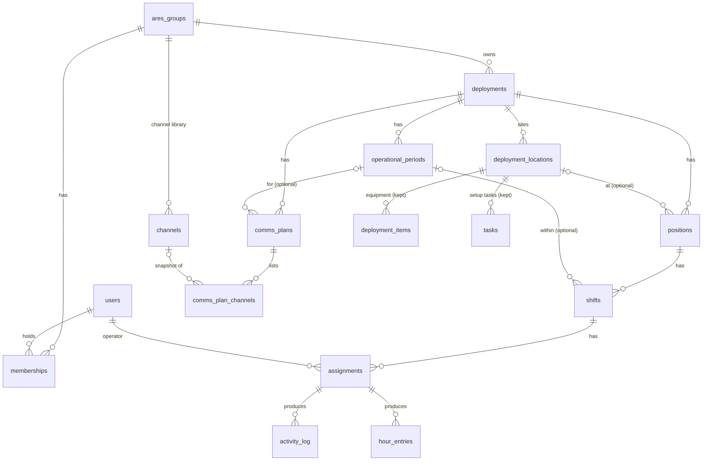

# Emcomm Planner: Implementation Roadmap

Status: living document. Started 2026-09-07 against `v1.1.0`. Progress is
tracked in [IMPLEMENTATION_STATUS.md](IMPLEMENTATION_STATUS.md).

Inputs: the product vision document ("Product Vision, Requirements, and
Development Roadmap", v1.0, 7 Sep 2026), the Publix Atlanta Marathon 2026
operating artifacts (HRO Handbook, Shared Assignments and Frequencies sheet,
Vehicle Operations Plan, APRS SOP, gear list), the live database, and the
code at `v1.1.0`.

---

## A. Current architecture (as shipped at v1.1.0)

| Layer | What exists |
|---|---|
| Client | React 18 + Vite 6, JavaScript with JSDoc `checkJs`, Tailwind + Radix primitives, TanStack Query, React Router. One codebase delivered as website, PWA (Workbox) and Windows desktop (Tauri 2, signed auto-update). |
| Data access | `src/api/db.js` repositories over Supabase PostgREST; `src/hooks/useEntities.js` React Query hooks; Realtime invalidation per table. |
| Backend | Supabase project `rboklyjrdctsbarsbtdj`: Postgres + RLS, Auth (email/password + invite), Storage (avatars), six Deno Edge Functions (`invite-user`, `create-or-update-user-profile`, `cleanup-deleted-user`, `export-deployment`, `export-ics205` (unused), `get-what3words` (disabled)). |
| Schema | 12 tables: `ares_groups`, `users`, `deployments`, `deployment_locations`, `categories`, `deployment_items`, `tasks`, `events` + `event_acks`, `deployment_templates`, `ics205_forms`, `notifications`. Migrations 001–007 applied. |
| Offline | Service worker precache; NetworkFirst cache of Supabase REST reads (14 d); CacheFirst map tiles; cached identity (7 d). Only `tasks` are writable offline, through a ULID event log with an IndexedDB outbox and a server materialisation trigger with a forward-only status machine. |
| Auth model | Global `users.app_role` in {admin, operator, viewer, pending}; `users.ares_group_ids TEXT[]` is the membership list, self-editable. |
| Tests / CI | 13 Vitest files, 117 cases (lib logic, API wrappers, auth context, two component tests). CI: lint, typecheck, test, build, Tauri compile. Tag-driven release with automatic web deploy. |

Live data (2026-09-07): 1 ARES group, 1 user (admin, KK4ODA), 1 deployment,
2 sites, 0 items, 0 tasks, 60 task events, 0 templates, 0 ICS-205 forms. There
is no production data to protect beyond that; migrations can be forward-only.

Base44: no packages, imports, env vars, endpoints or generated code remain
(removed in v1.0.0; see `base44-migration.md`). Nothing depends on it directly
or indirectly. The only lingering artifact of that era is the *shape* of the
data model (per-site items and tasks, per-site ICS-205), which this roadmap
replaces.

## B. Existing functionality

Works today: deployments with lifecycle and readiness; sites with map,
coordinates, contact, operator roster; equipment categories/items with
assignment and bulk assign; per-site setup tasks (offline-capable); per-site
ICS-205 editor with client-side PDF; templates and deployment duplication;
members with roles, invitations, avatars; ARES groups (admin); notifications
for task assignment/completion/equipment shortage; My Assignments with go-kit
ticks; desktop updater; PWA.

Missing entirely: positions/shifts/assignments, operator capabilities,
operational periods, a channel library, a deployment-scoped communications
plan, an operator briefing packet, check-in/out, hours, an NCS board,
organization-scoped read security.

## C. Research-to-code gap analysis

Sources: **V** = vision document section, **PAM** = marathon artifacts,
**Code** = observed in repository/live DB.

| Requirement | Source | Existing support | Gap | Proposed solution | Priority |
|---|---|---|---|---|---|
| Read isolation between ARES groups | V §3.4 #3, §16.1 | `deployments_select` only | 8 tables `USING (true)`; any signed-in user reads all members' phones/emails and all plans | Migration 008: every SELECT scoped through group membership or admin; `users` visible to same-group members only | **P0, first** |
| Event-log write path enforces role | V §3.4 #4 | none | any authenticated user can create/update/delete tasks by inserting events; `actor_user_id NULL` allowed | `events_insert` requires `actor_user_id = auth.uid()`, role in (admin, planner, operator), deployment access; functions get fixed `search_path`; EXECUTE revoked from anon/authenticated | **P0** |
| Membership by approval, not self-service | V §3.4 #5, §15.1 | `RequireAresGroup` writes own `ares_group_ids` | user joins any group and reads its deployments | `memberships` table (status pending/active); join becomes a request; admin approves; `users.ares_group_ids` becomes a trigger-maintained mirror of *active* memberships (read-only for clients) | **P0** |
| Call sign unique and validated | V §3.4 #6 | client regex only | duplicates collide in every assignment join and in `notify_user_by_callsign` | unique index on `upper(call_sign)`, format check | **P0** |
| Planner role distinct from field operator | V §16.2 | operator can edit deployments | coordinators must be admins; operators can edit plans | add `planner` role (global); operator loses plan edits, keeps field actions | **P0** |
| Position → Shift → Assignment | V §3.3, §9.2, §15.3; PAM assignment sheet | none; sites hold `assigned_call_signs` | plan cannot express "AID MILE 12, 0515–1400, one operator, TAC AID 12" | new tables `positions`, `shifts`, `assignments`; existing site rosters migrated to one position per site | **P0** |
| Operational periods | V §9.18, §15.3 | `deployments.start_date/end_date` (DATE) | no time-of-day, no shifts, ICS forms have no period | `operational_periods` table; `deployments.starts_at/ends_at` timestamptz | **P0** |
| Operator capability profile (short) | V §9.1, US-9 | call sign, phone, APRS | nothing about bands, modes, Winlink, power, mobility, license | columns on `users`: `license_class`, `capabilities TEXT[]`, `station_types TEXT[]`, `power_hours`, `locality`, `equipment_notes`; 8-field progressive profile UI | **P0** |
| Requirement matching / candidate ranking | V §9.10, US-2 | none | gaps found by email poll | `positions.requirements JSONB`; pure-function matcher `matchOperator(position, shift, user, otherAssignments)` drives ranked candidates and "at risk" cells | **P0 (basic)**, P1 (full readiness list) |
| Staffing board with coverage gauge | V §9.3, US-2 | deployment readiness stats | no "48 of 62 covered" | Positions page: positions × shifts grid, headline count, filters, assign dialog | **P0** |
| Offer / accept / decline | V §9.7, US-6 | none | coordinator cannot tell who has read the plan | assignment status ladder `offered → accepted/declined → checked_in → on_position → released`; operator taps from packet | **P0** |
| Operator packet (offline, versioned) | V §9.4, §10.1, US-5; PAM briefs | none | briefing assembled from emails and a sheet | `/packet` route: above-the-fold where/when/TAC/primary freq; sections per US-5; printable; cached by existing NetworkFirst SW cache; `deployments.plan_version` + `assignments.packet_version_seen` drives change banner | **P0** |
| Channel library (ICS-217A) | V §9.5, US-3; PAM frequency sheet | none | frequencies retyped per site | `channels` table per ARES group with the 217A field set; normalisation to 4 decimals; inactive flag | **P0** |
| Deployment-scoped comms plan → ICS-205 | V §3.4 #1, §9.5, US-4 | per-site `ics205_forms` | N inconsistent plans per event | `comms_plans` (deployment, period, version) + `comms_plan_channels` (snapshot of library row + function/assignment/condition/PACE); ICS-205 PDF from plan with wrapping cells; per-site editor retired | **P0** |
| Degradation ladder (Condition 1/2/3, PACE) | V §9.6 | none | backup path in prose | `condition_level` + `path_role` on plan channels; packet prints all levels | **P0** |
| Check-in / on position / check-out, offline | V §9.8, US-7 | task outbox only | no shared picture; hours from memory | RPC `set_assignment_status` (monotonic, idempotent); client `assignmentStatus.js` with IndexedDB intents outbox drained by `syncEngine`; activity log rows by trigger | **P0** |
| Hours derived from assignments | V §9.9, US-8 | none | monthly email chase | `hour_entries` written by trigger on `released`; estimated flag when check-out missing; manual entries | **P0 (capture)**, P1 (rollup/report) |
| Site logistics fields | V §9.4, P0 table; PAM Brief parking text | address, contact | no parking, arrival, access notes | columns `parking_notes`, `arrival_notes`, `access_notes`, `lat/lon` | **P0** |
| NCS board | V §6.3, §9.8 | none | check-in on paper | `/ncs` page: positions for current period, status, times, uncovered first, check-in on behalf | **P1 (early)** |
| Served agency / tasking / authorization | V §9.21 | none | authority unrecorded | columns on `deployments`; printed on packet header | P1 (cheap, included) |
| Change notification, affected only | V §9.7, US-10 | in-app notifications table | none | on publish: notification rows for operators with assignments in changed positions | P1 |
| Clone with lessons | V §9.14, §10.5 | duplicate (structure + assignments) | no lessons | `lessons` table; carry-forward on duplicate | P1 |
| AAR capture | V §9.15 | none | 15 attachments | short per-operator form on release + assembly page | P1 |
| ICS-214 / 205A generation | V §13.2 | none | hand-filled | derive from `activity_log` and assignments | P1 |
| Map layers, GPX/KML import | V §9.11 | Leaflet site map | no routes | import KML into deployment map layer | P1 |
| Asset registry with custody | V §9.13 | items per site | none | `assets` table; later | P1 |
| Objectives | V §9.16 | none | none | later | P1 |
| Open-shift board | V §9.7 | none | none | falls out of staffing board (open slots filter) | P1 |
| Notification preferences (SMS/push) | V §9.20 | email/in-app | none | later; needs a provider | P1 |
| CHIRP CSV export | V §9.5 | none | none | small; after comms plan | P1 |
| Roster CSV import | V §14 #13 | none | none | later | P1 |
| Coverage log, credentials, Field Day profile, Winlink ingest, LAN mode, AI AAR | V §9.12, 9.17, 9.19, 13.3, 11.2, 14.1 | none | — | deferred (§H) | P2/P3 |
| Categories / per-site items | V §3.5 | full feature | more configuration than the domain needs | keep as-is (works, tested); demote in navigation later; do not remove | keep |
| Event-sourcing spec, Ed25519, OR-sets, `event_acks`, four tiers | V §3.4 #8, §8.3 | doc only | expectation gap | rewrite `offline-architecture.md` to describe shipped reality; keep task event log as-is; new operational writes use a simple intents outbox | P0 (doc) |
| Outbox retry/dead-letter, syncEngine tests | V §3.4 #9–11 | none | silent failure | bounded retry with visible failed list; tests | P1 |
| Windows code signing | V §16.4 | pipeline ready | certificate | user decision (docs/release.md) | P1 |
| ICS-213, chat, IAP suite, auto-assign, native apps, CRDTs | V §17 | — | — | not built | never |

## D. Recommended domain model

Minimal additions that make the workflows expressible. Existing tables are
kept; new ones are added; nothing is dropped.

Entities and the decisions behind them:

- **ARES group = organization.** Renaming the table buys nothing; the UI
  already says "ARES group" and the users are ARES groups. `memberships`
  replaces the self-writable array as the source of truth; a trigger mirrors
  active memberships into `users.ares_group_ids` so every existing read path
  (client `canAccessDeployment`, RLS helper) keeps working unchanged.
- **Roles stay global** (`app_role`), gaining `planner`. Per-organization
  roles are the right long-term answer (vision §15.1) but there is one
  organization in production and no observed need; the memberships table
  carries a `role` column so the switch later is a policy change, not a
  migration.
- **Position** is a job, optionally at a site, with `tactical_callsign`,
  `position_type`, `headcount`, `requirements JSONB` (controlled vocabulary,
  matched client-side), `briefing_notes`, `supervisor_position_id`, `net`
  label. Requirements are JSONB rather than rows because they are always
  read and written with the position and the matcher runs in the client.
- **Shift** = a time window on a position (`starts_at`, `ends_at`,
  `muster_at`, `headcount`), optionally inside an operational period.
- **Assignment** = one operator on one shift, with the monotonic status
  ladder and timestamps. It is the plan, the acknowledgement, the check-in
  record and the hours source.
- **Operator capabilities** live on `users` as arrays and scalars, not in
  child tables: the vocabulary is small, the matcher needs them together, and
  it keeps the profile a single row for RLS and offline caching.
- **Channel** (library, per ARES group) and **comms plan channel** (a
  snapshot copied from the library plus plan-specific function, assignment,
  `condition_level`, `path_role`). Snapshotting satisfies US-4 ("editing the
  library does not silently alter a published plan").
- **activity_log** (append-only) and **hour_entries** are written by server
  triggers from assignment status changes so the client never has to.
- **plan_version** on `deployments`, bumped by an explicit "Publish changes"
  action with a note; `assignments.packet_version_seen` drives the change
  banner. Automatic diffing is deferred.

## E. Architecture decisions

1. **Security first, in one migration (008).** Every deployment-scoped table
   is scoped through `deployment_visible(deployment_id)`; `users` through
   shared group membership; the event log through role and deployment
   access. All `SECURITY DEFINER` functions get `SET search_path = public`
   and lose `EXECUTE` for `anon`/`authenticated` where they are triggers.
2. **Additive schema.** New tables alongside old. `deployment_locations`
   keeps its name (the app calls them sites). `ics205_forms` stays in the
   database but the UI stops using it; the per-site ICS-205 button is
   replaced by the deployment communications plan.
3. **Offline writes for operations use a small intents outbox**, not the
   task event log. An intent is `{ id, assignment_id, status, at, note }`,
   idempotent, applied by an RPC that enforces the monotonic ladder. The
   existing `syncEngine` drains both outboxes. The task event log is kept
   as-is (it works and is tested); it is not extended.
4. **The packet is a projection.** No stored document. It renders from the
   assignment, shift, position, site, deployment, comms plan and supervisor
   contact, all of which are already cached by the service worker's
   NetworkFirst rule once viewed online. Printing reuses the client PDF path
   (jsPDF) for a one-page order.
5. **Plain language in the operator UI**, ICS terminology on generated forms.
6. **No new heavy dependencies.** No CRDT library, no state machine library,
   no scheduling engine. Matching and coverage are pure functions in
   `src/lib/` with tests.
7. **Version 2.0.0.** The role change (operators lose plan editing) and the
   move of ICS-205 from site to deployment are user-visible behaviour
   changes.

## F. Prioritized implementation plan

### Phase 0: Foundation (security and roles)

- Migration 008: `memberships`, mirror trigger, `planner` role, scoped
  SELECT policies, event-log policy, call-sign uniqueness, function
  hardening, `users` PII exposure limited to same-group members.
- Client: `RequireAresGroup` becomes a join request; Members page gains
  approval of pending memberships; permissions matrix gains planner and
  removes plan edits from operator; role dialog offers planner.
- Docs: `offline-architecture.md` rewritten to shipped reality.
- Exit: a second group can be onboarded without seeing the first group's data.

### Phase 1: The staffable plan (vertical slice 1)

- Migration 009: `operational_periods`, `positions`, `shifts`,
  `assignments`, operator profile columns, site logistics columns,
  deployment `starts_at/ends_at`, served agency fields, `plan_version`;
  data migration of existing site rosters into positions; RLS.
- Lib: `staffing.js` (coverage, slot expansion, candidate ranking,
  requirement matching, overlap detection), `capabilities.js` vocabulary.
- UI: Positions page (board + position form with shifts and requirements +
  bulk create), assign dialog with ranked candidates, operational periods
  editor, deployment schedule fields, operator profile "What I can do".
- Operator: My Assignments shows offered positions with Accept / Decline.
- Exit: coordinator sees "X of Y covered"; operator accepts from phone.

### Phase 2: Packet and communications plan (vertical slice 2)

- Migration 010: `channels`, `comms_plans`, `comms_plan_channels`; RLS.
- UI: Channel library page (per group), Comms plan page per deployment
  (PACE + conditions), ICS-205 PDF from plan (wrapping fixed), CHIRP CSV.
- Packet page `/packet` (+ `/packet/:assignmentId`), printable, change
  banner, "as of" stamp; landing page for operators with a current
  assignment on phones.
- Exit: an operator needs nothing but the packet link.

### Phase 3: Operations and the record (vertical slice 3)

- Migration 011: `activity_log`, `hour_entries`, RPC
  `set_assignment_status`, triggers.
- Client: intents outbox + drain; Check in / On position / Check out on the
  packet with pending state; NCS board `/ncs` with check-in on behalf;
  hours list on profile with manual entry.
- Exit: after an event nobody asks for hours.

### Phase 4: Memory and reporting (as time permits, in this order)

Publish-with-notification to affected operators; lessons carried on
duplicate; AAR form; ICS-214/205A; hours rollup CSV; map KML import; asset
registry; objectives.

## G. Risks

- **Migration risk**: low (one deployment, two sites, no items/tasks). Data
  migration of site rosters is idempotent and additive. Rollback = drop new
  tables; old tables untouched.
- **Security risk**: tightening `users` SELECT can break UI paths that list
  all members (Members page, assignment pickers). Mitigation: same-group
  visibility plus admin; the only production user is an admin; tests on the
  policy SQL are not possible in Vitest, so verify with `get_advisors` and
  SQL probes as the pending role.
- **Architectural risk**: two outboxes (events, intents). Mitigation: shared
  drain loop, shared pending counter, small and documented.
- **UX risk**: the Positions page can become an ERP grid. Mitigation: one
  headline number, one grid, one dialog; plain language; mobile packet is a
  separate, minimal surface.
- **Scope risk**: this document lists more than one session can finish.
  Mitigation: phases are vertical; each ends releasable; status file records
  the exact stopping point.
- **Behaviour change risk**: operators lose deployment editing. Mitigation:
  role labels/descriptions updated; the one live account is an admin.

## H. Deferred features (valuable, not now)

Per-organization roles; SMS/push notifications; automatic packet diffing;
capability-based recruiting links and roster CSV import; coverage log;
credentials and requirement sets; Field Day profile; Winlink and APRS
ingestion; LAN-hosted mode; AI-assisted AAR; section rollups; asset custody;
objectives; ICS-204/309; RF/BBS sync; community channel sharing; light-theme
type-scale control beyond what exists; Windows code signing (needs a
certificate purchase decision).

Explicitly not built (vision §17): messaging, ICS-213, IAP suite, automatic
assignment optimisation, general volunteer CRM, real-time co-editing, own map
stack, RepeaterBook dependency, CRDTs/signing, native apps, LMS, chatbots,
public deployment pages.
