# Planning the Publix Atlanta Marathon

*A step-by-step walk through EmComm Planner using a real public-service event: 36 positions, two voice nets, APRS tracking and a downtown course.*

> Scenario: Sunday 7 March 2027, Atlanta. ARES supports the Atlanta Track Club with radio operators at 13 aid stations, in 7 SAG vehicles, 4 motorcycles and a bicycle, with the pace, cone and course-director vehicles, at the medical tent, and at net control in the AFCEMA Multi-Agency Coordination Center.
> Audience: a planner or admin building the deployment. Operators can read Steps 7 and 10 to see what they get.
> Time: about 90 minutes the first year. The second year starts from Duplicate and takes twenty.

Written for EmComm Planner 2.6.1. Live guide: https://emcommplanner.org/guide

## What you will build

By the end of this tutorial the marathon exists in EmComm Planner as one deployment: sites with pins and arrival notes, positions with tactical calls, shifts and requirements, a channel library, a three-condition communications plan, equipment kits, a safety checklist and a published packet for every operator. Every screenshot in this guide was taken from that finished deployment.

| Item | In this scenario |
| --- | --- |
| Event | Publix Atlanta Marathon, half marathon and 5K, Sunday 7 March 2027 |
| Served agency | Atlanta Track Club (ATC) |
| Net control | AFCEMA Multi-Agency Coordination Center (MACC), 130 Peachtree St SW |
| Voice nets | RACE (aid stations, shadows, pace cars) on W4DOC 146.820; SAG (vehicles, motos, medical) on W4AQL 145.150 |
| Tracking | APRS-IS from phone apps, every vehicle beacons as CALL-5 |
| Positions | 13 aid stations, 7 SAGs, 4 motos, 1 bicycle, 4 shadows, 2 medical, 5 net-control desks: 36 positions, 42 seats |
| Report times | 04:30 to 08:45 depending on position; aid stations close as the last runner passes |

### Before you start

- You are signed in at emcommplanner.org with the **Planner** or **Admin** role in your ARES group. Operators cannot create deployments.
- Have the served agency's material at hand: the assignment sheet from last year, the frequency plan, and the course map as KML, GPX or GeoJSON. Google My Maps exports KML from its menu.
- Work down the left menu in the order of this tutorial. **Readiness** tells you at any moment what is still missing.

> **Tip.** Every screen in this guide has a matching section in the user guide at emcommplanner.org/guide. This tutorial shows one way through; the guide is the reference.

## Step 1. Create the deployment

A deployment is the container for one event: its sites, positions, plan and record. Give it the served agency and the tasking reference now; both print on the deployment order and answer the question "who asked us to be here" if it ever comes up.

**Do this**

1. Open **Deployments** in the left menu and click **New deployment**.
2. Fill in the form as in the table below. Pick **Public service event** as the kind.
3. Expand **Served agency and authorization** and fill in the agency, the requesting official and the tasking reference.
4. Click **Create deployment**. The new event appears in the deployment switcher at the top of every page; select it there.

**Enter this**

| Field | Value |
| --- | --- |
| Deployment name | Publix Atlanta Marathon 2027 |
| Kind | Public service event |
| ARES group | Your group (DeKalb ARES in the screenshots) |
| Starts / Ends | 03/07/2027 04:00 AM to 03/07/2027 03:00 PM |
| Region / area | Atlanta, GA |
| Description | Marathon, half marathon and 5K through downtown Atlanta. ARES staffs every aid station, the SAG vehicles, the pace and course vehicles, the medical tent and net control in the AFCEMA MACC. |
| Served agency | Atlanta Track Club |
| Requesting official | ATC Race Operations, volunteer coordinator |
| Tasking reference | ATC volunteer radio operator request, January 2027 |

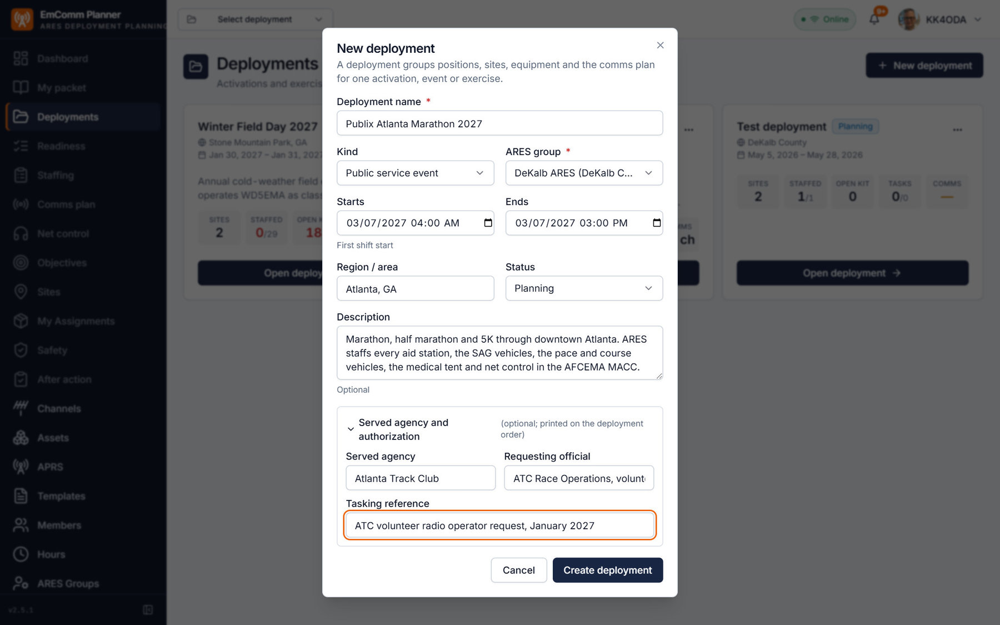

*The New deployment form with the marathon filled in. Start and end are the first report time and the last release.*

> **Why it matters.** The start and end times bound the net control board and the hours report. The served agency and tasking reference are your authorization record: AUXCOMM doctrine says never self-deploy, and this is where the request is written down.

## Step 2. Import the course map

Atlanta Track Club publishes the course and the ARES pickup routes as a Google My Maps layer. Import it once and every site, packet and the net control board draw on top of it. Do this before adding sites so you can place pins against the real course.

**Do this**

1. Open **Sites** and click **Map layers**.
2. Choose the KML file (in the screenshots: PAM 2026 ARES Map.kml, 41 routes and 50 points). Name the layer and pick a colour.
3. Click **Add layer**. Switch to the **Map** tab to see the course, the SAG approach routes and the pickup points under your sites.

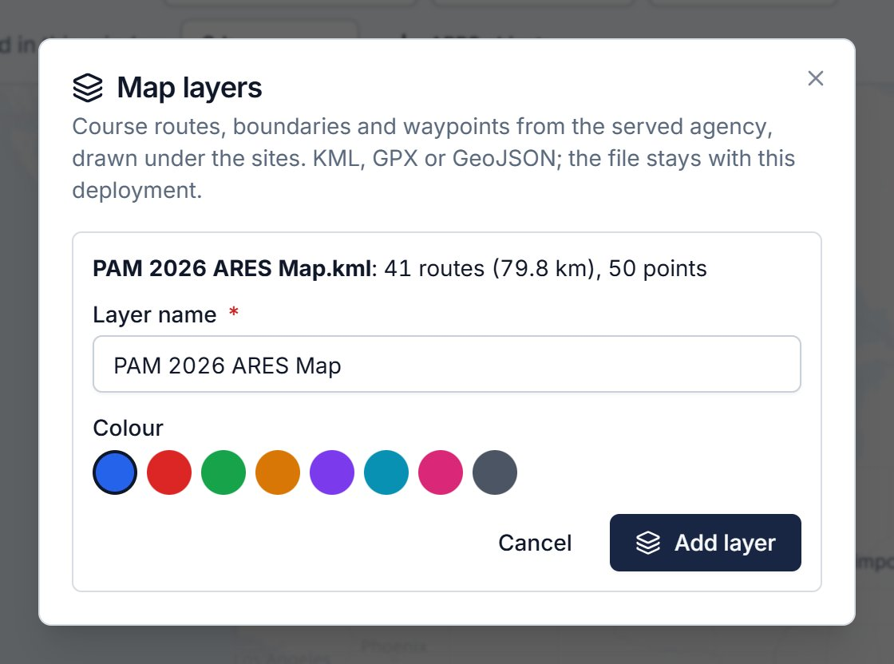

*The Map layers dialog after choosing the KML: it reports what it found before you add it.*

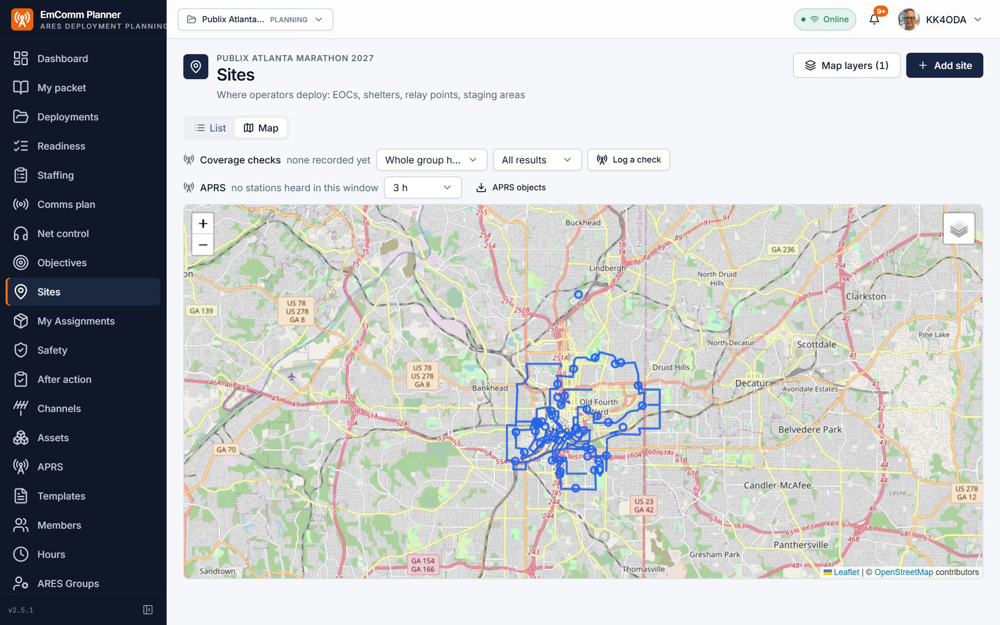

*Sites, Map tab: the course layer with the aid stations and net control pinned on top. The map is what operators see on their packets.*

> **Tip.** A layer with waypoints offers **Sites from N points**, which turns every placemark into a site in one click. The 2026 map mixes mile markers, ramps and pickup spots, so this tutorial adds the sites by hand instead and keeps the layer as a backdrop.

## Step 3. Add the sites

A site is a place an operator reports to. The three lines that matter most are parking, arrival and access: they go straight into the packet and answer the questions that otherwise arrive by email the night before. Add net control, the ATC warehouse, the start and finish area, the medical tent, the SAG drop-off, and one site per aid station.

**Do this**

1. On **Sites**, click **Add site**.
2. Type the name, pick a type, and paste the address or "latitude, longitude" into **Location**. Click the map to drop the pin exactly where the operator should stand.
3. Fill in **Parking**, **Arrival / where to report** and **Access / credentials**. Save.
4. Repeat for the other sites. The **Order** field controls the sequence on the packet map and in lists; number the aid stations by mile.

**Enter this**

| Field | Aid station mile 20 |
| --- | --- |
| Site name | Aid station mile 20 |
| Type | Aid / hydration station |
| Location | Cherokee Ave and Milledge Ave SE, just inside Zoo Atlanta (pin 33.7387, -84.3736) |
| Site contact | Aid station captain (ATC volunteer) |
| Parking | Street parking within two blocks; roads on the course close 30 minutes before the first runner. |
| Arrival | Report directly to the station at the time on your packet. Find the station captain, then check in with NCS RACE. |
| Access | Inside the zoo perimeter fence; the gate opens at 05:30 for volunteers. |

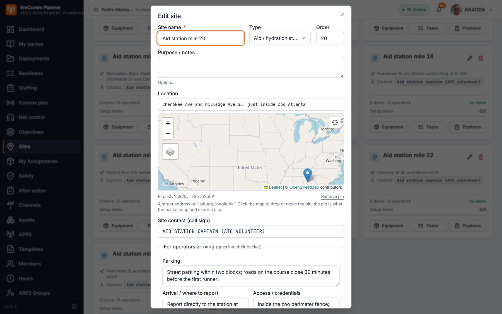

*Edit site for Aid station mile 20. The map opens on the pin; click it to move the pin.*

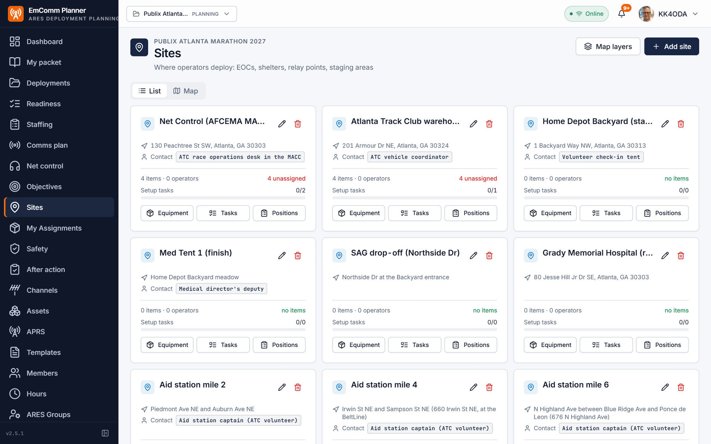

*The Sites list after all 19 sites are in: net control, the warehouse, the finish area, medical, the drop-off, the hospital for reference, and 13 aid stations.*

| Site | Type | Why it is a site |
| --- | --- | --- |
| Net Control (AFCEMA MACC) | Net control location | Five desks report here at 05:00; badge and parking notes |
| Atlanta Track Club warehouse | Staging / muster point | SAG, pace, cone and course-director operators meet their drivers at 05:30 |
| Home Depot Backyard | Start / finish area | Volunteer check-in, Red Deck parking |
| Med Tent 1 (finish) | Medical tent | MED 1 and MED 2; wet-bulb readings |
| SAG drop-off (Northside Dr) | Checkpoint | Where SAGs unload; not the medical tent |
| Aid station mile 2 to 24 | Aid / hydration station | One per staffed station, pinned on the course |

> **Why it matters.** Aid station operators report straight to their station, never to volunteer check-in. Putting that in the arrival note of every aid site is what stops thirty people asking the same question.

## Step 4. Create the positions

A position is a job: a tactical call, a place, a time window and what it needs. Real events are position-shaped, so this is where most of the planning lives. Create the thirteen aid stations in one go, then the SAGs, then the one-offs.

### Create several at once

**Do this**

1. Open **Staffing** and click **Create several**.
2. Enter the patterns from the table. `{n}` is replaced by each number, so AID MILE {n} with the numbers 2, 4, 6 becomes AID MILE 2, AID MILE 4 and AID MILE 6 with tactical calls AID 2, AID 4 and AID 6.
3. Set the type to **Aid / hydration station**, the net to **RACE**, add the requirements and one shift (05:15 to 14:30 is a safe default; you will trim each station in a moment).
4. Click **Save as scheme** so next year the position form fills these defaults as you type the name. Then create.

**Enter this**

| Field | Value |
| --- | --- |
| Name pattern | AID MILE {n} |
| Tactical call pattern | AID {n} |
| Numbers | 2, 4, 6, 8, 9, 11, 12, 14, 16, 18, 20, 22, 24 |
| Type / Net | Aid / hydration station / RACE |
| Requirements | VHF/UHF voice (must), 6 h independent power (must), External / mag-mount antenna (nice to have) |
| Shift | 03/07/2027 05:15 AM to 02:30 PM, muster 05:15, period Race day |

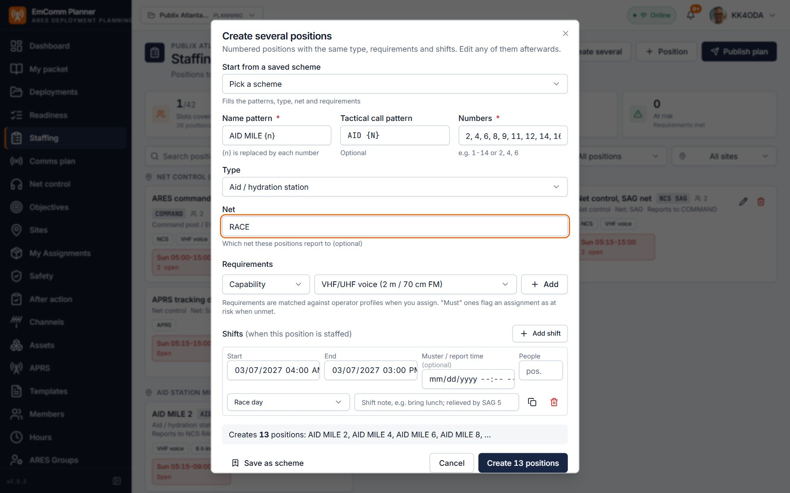

*Create several positions: the preview at the bottom lists the 13 positions before anything is saved.*

### Tune each position

Open a position with the pencil icon to set its site, its report time and its briefing notes. AID MILE 12 is the example: it sits on the stadium ramp where handhelds cannot reach the repeaters, so it gets a cross-band requirement and a note.

**Do this**

1. Click the pencil on **AID MILE 12**.
2. Set **Site** to Aid station mile 12 and **Reports to** NCS RACE (create the net control positions first if you have not; see the table below).
3. Adjust the shift to the real window: 05:30 to 11:45 for mile 12; aid stations close roughly 30 minutes after the last runner passes.
4. Add **Cross-band repeat** as a nice-to-have requirement and write the briefing note. Save.

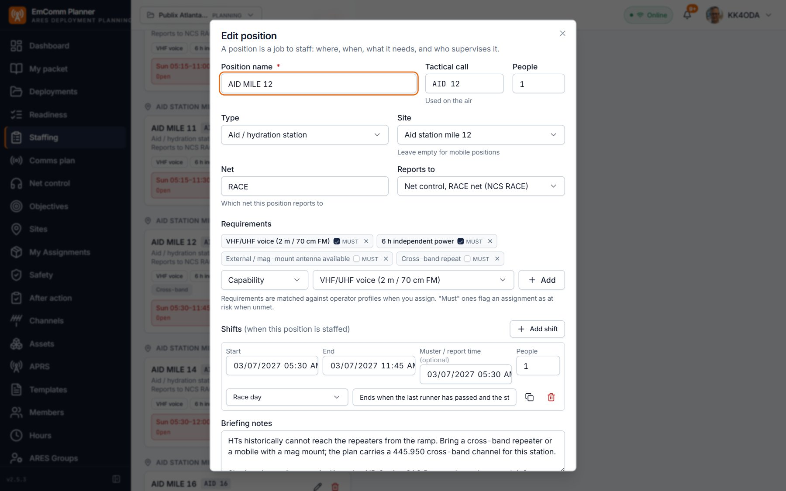

*Edit position for AID MILE 12: type, site, net, supervisor, requirements, the shift with its muster time, and briefing notes that print on the packet.*

### The rest of the roster

| Positions | Type | Net | Site | Shift | Requirements |
| --- | --- | --- | --- | --- | --- |
| COMMAND (IC and Ops Chief, 2 seats) | Command post | none | MACC | 05:00-15:00 | Net control, VHF voice |
| NCS RACE (2), NCS SAG (2), NCS APRS | Net control | RACE / SAG | MACC | 05:00-15:00 | Net control; APRS for the tracking desk |
| PHONES (3 seats) | Call taker | SAG | MACC | 06:00-14:30 | No amateur licence needed |
| SAG 1 to SAG 7 SWEEP | SAG vehicle | SAG | ATC warehouse | 05:30-14:30 | VHF voice, APRS, external antenna |
| MOTO ALPHA to DELTA, BICYCLE | Motorcycle / bicycle | SAG | mobile | 05:45-14:00 | VHF voice, motorcycle or bicycle |
| COURSE DIR, CONES, FULL PACE, HALF PACE | Shadow | RACE | ATC warehouse | 04:30-14:00 | VHF voice, window-clip antenna |
| MED 1, MED 2 | Medical liaison | SAG | Med Tent 1 | 06:00-14:30 | VHF voice |

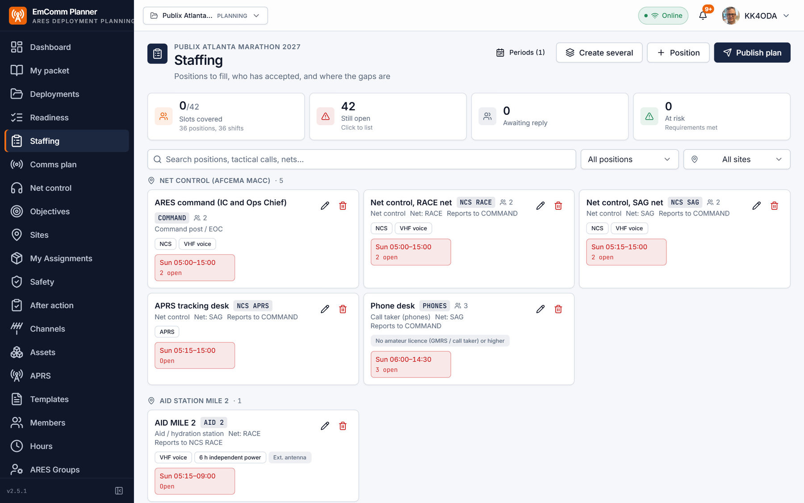

*Staffing after all 36 positions exist: grouped by site, with the requirements as chips and every shift still open. The header counts 42 seats.*

### Operational periods

A one-day race needs a single period. Open **Periods** and confirm "Race day" spans 04:00 to 15:00; the ICS forms and the comms plan are scoped to it.

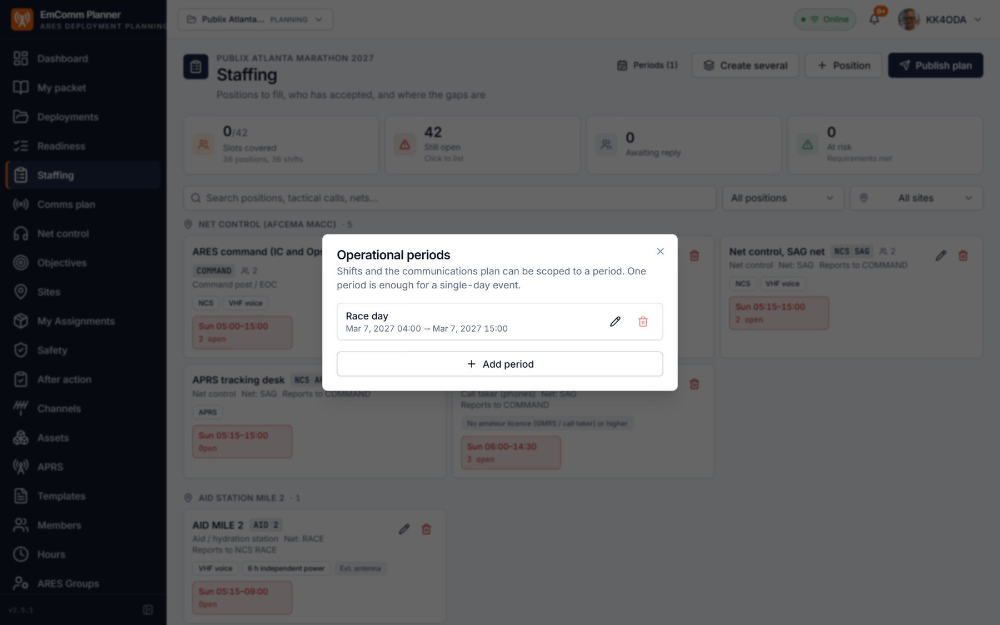

*Operational periods: one is enough for a single-day event.*

> **Tip.** Position names are what the sheet says (AID MILE 20); tactical calls are what is said on the air (AID 20). Net control never has to invent a call during the race, and the packet prints both.

## Step 5. Build the channel library

Frequencies are entered once, in the group's **Channels** library, and every plan picks from there. The library is the group's ICS-217A. Enter the two net repeaters, the two backups, simplex, the cross-band pair, the all-call phone and the APRS path.

**Do this**

1. Open **Channels** and click **Channel** for each row in the table. The form suggests the transmit frequency from the standard offset when you type the receive frequency.
2. For the phone number choose the kind **Phone number**; for APRS choose **Digital / gateway** with the mode APRS.
3. Put anything an operator must know in **Remarks**; it prints on the ICS 205.

**Enter this**

| Channel | Kind | RX / TX / tone | Owner | Remarks |
| --- | --- | --- | --- | --- |
| RACE net repeater (W4DOC 146.820) | Repeater | 146.820 / 146.220 / 146.2 | W4DOC | Atlanta Radio Club |
| SAG net repeater (W4AQL 145.150) | Repeater | 145.150 / 144.550 / 167.9 | W4AQL | Georgia Tech |
| Backup 70 cm repeater (WB4RTH 444.975) | Repeater | 444.975 / 449.975 / 100.0 | WB4RTH | Alternate for the SAG net |
| Backup 2 m repeater (WB4RTH 147.105) | Repeater | 147.105 / 147.705 / 110.9 | WB4RTH | Alternate for the RACE net |
| Simplex 146.550 | Simplex | 146.550 |  | Repeaters-down fallback |
| Simplex 446.000 | Simplex | 446.000 |  | 70 cm simplex |
| AID 12 cross-band 445.950 (+ backup 445.975) | Simplex | 445.950 / PL 77.0 |  | Stadium ramp |
| Net control all-call phone | Phone number | your number |  | Voice only, never text |
| APRS-IS via phone app | Digital / APRS | CALL-5 |  | aprs.fi or APRSdroid over cellular |

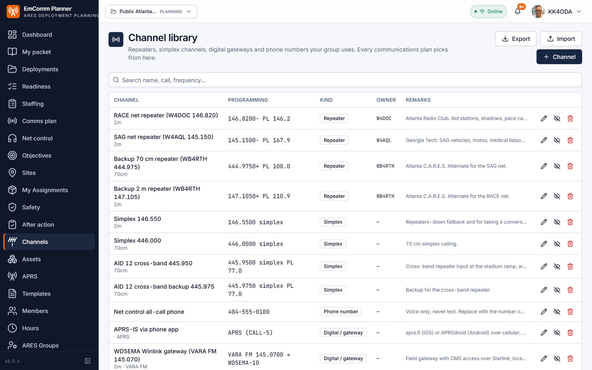

*The channel library. Export hands it to another group as a file; Import takes theirs.*

> **Why it matters.** In 2026 the frequency plan travelled as a spreadsheet tab and one volunteer's whole reply to the recruiting thread was "I'll need a frequency list". Here the list is on every packet and in the CHIRP file automatically.

## Step 6. Write the communications plan

The plan says which channel each net uses, in normal conditions and when things fail. Condition 1 is the ICS 205; Conditions 2 and 3 print on every packet so an operator knows what to do when a repeater or the phones go away. Each row has a PACE role: primary, alternate, contingency or emergency.

**Do this**

1. Open **Comms plan** and click **Create plan** if there is none.
2. Click **Add channels** and pick the library rows. For each row set the condition, the role, the function (Tactical, Data, Phone) and the **net** it belongs to (RACE or SAG). Rows without a net print on every packet.
3. Give the primaries channel numbers 1 to 7 so the CHIRP file and the ICS 205 agree with what people programmed.
4. Write the **special instructions** and your name as preparer, then **Save details**. Watch **Plan check** on the right turn green.

**Enter this**

| Condition | Net | Primary | Alternate | Contingency / Emergency |
| --- | --- | --- | --- | --- |
| 1 Normal | RACE | W4DOC 146.820 | WB4RTH 147.105 | Simplex 146.550 / all-call phone |
| 1 Normal | SAG | W4AQL 145.150 and APRS-IS | WB4RTH 444.975; AID 12 cross-band | Simplex 146.550 / all-call phone |
| 2 Degraded | RACE / SAG | same repeaters | same backups | no phones: SAGs report position by voice every 15 min |
| 3 Repeaters down | RACE | Simplex 146.550, relays AID 12 and MED 1 |  | Backup 440 if any repeater survives |
| 3 Repeaters down | SAG | Simplex 446.000, relay NCS SAG |  |  |

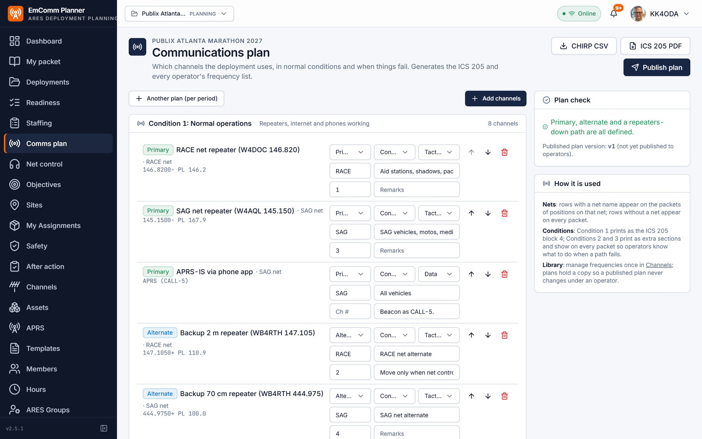

*Condition 1 of the plan: each row carries role, condition, function, net, assignment, channel number and remarks. Plan check on the right confirms a primary, an alternate and a repeaters-down path exist.*

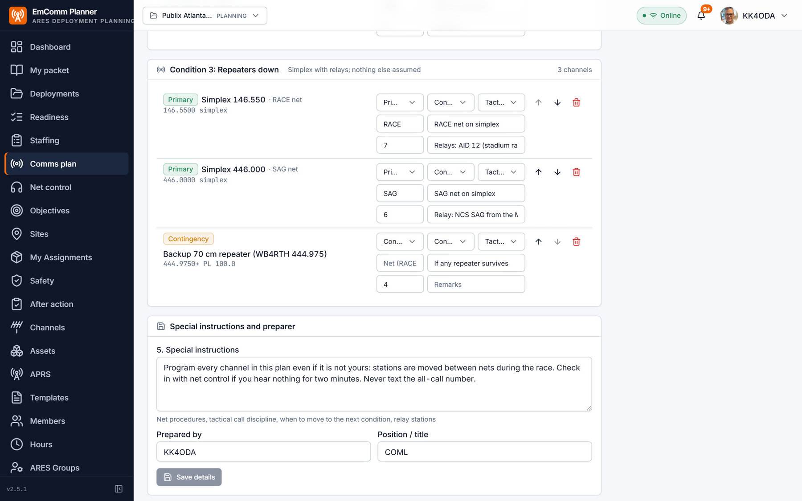

*Condition 3 and the special instructions block. "Program every channel even if it is not yours" is the sentence that saves the day when net control moves a station.*

> **Tip.** **CHIRP CSV** exports the plan for radio programming and **ICS 205 PDF** prints the form. Both come from the same rows, so they cannot disagree with the packets.

## Step 7. Staff the positions

Now people. Each shift chip on Staffing opens the assign dialog, which ranks your roster by how well the profile matches the position and whether the person is free. You can offer, assign directly, or tell every qualified operator that the shift is open. Operators can also take open shifts themselves.

**Do this**

1. On **Staffing**, click the shift chip under **AID MILE 20**.
2. Read the candidate list. Green means the profile meets every requirement; amber lines say what is missing ("Profile does not say: 6 h independent power") so you can ask before race day, not at the aid station.
3. Click **Offer** to ask the operator (they get a notification and answer from My Assignments) or **Assign as confirmed** when you already have their yes.
4. For shifts nobody has claimed, click **Notify N qualified**: every free operator whose profile fits is told the shift is open.

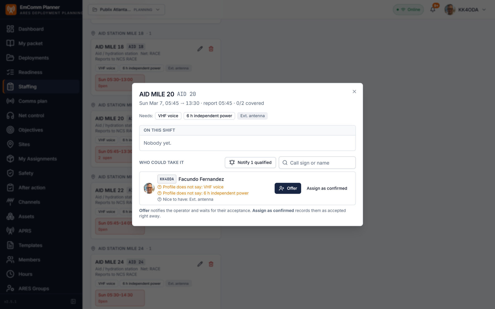

*The assign dialog for AID MILE 20: needs at the top, who is on the shift, and who could take it with the reasons for the ranking.*

### What the operator sees

Operators answer offers and pick up open shifts from **My Assignments**. Shifts they do not qualify for, or that overlap one they already hold, say so instead of hiding.

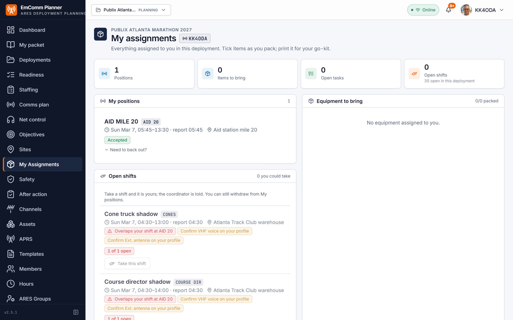

*My Assignments for an operator holding AID MILE 20: the accepted position, then open shifts with the reasons they cannot take them.*

> **Why it matters.** The 2026 marathon needed three escalating appeals over five weeks. With open shifts visible and notifications targeted at qualified people, the coordinator sees exactly which seats are short instead of counting replies.

## Step 8. Equipment kits and setup tasks

The **Dashboard** holds per-site equipment lists and tasks. Use categories for the kits (aid station, SAG vehicle, net control) and mark the essentials, so Readiness can warn when nobody is bringing them. Tasks with a due date keep the pre-race checks visible.

**Do this**

1. Open **Dashboard**, click **Category** and create "Aid station kit", "SAG vehicle kit" and "Net control kit".
2. Click **Item** for each piece of gear, choose the category, the site it belongs to, a quantity and a priority. **Assign** it to the operator who brings it once you know.
3. Add tasks on the site cards: "Confirm MACC roof antenna and feedline" due 26 February, "Cross-band repeater test at the stadium ramp" due 27 February, "Confirm vehicle types with ATC" due 24 February.

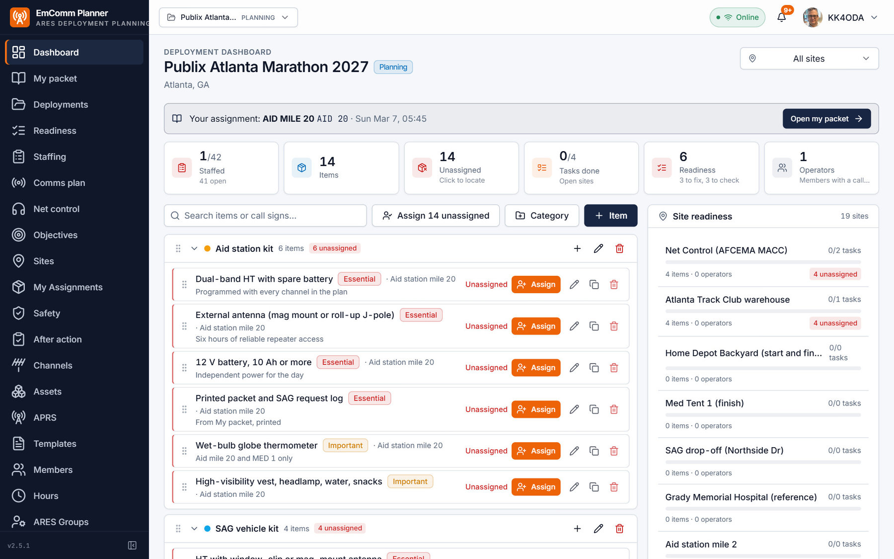

*Dashboard with the aid station kit: essentials in red until someone is assigned to bring them; site readiness on the right.*

> **Tip.** The aluminium-bodied rental vans of 2026 defeated every mag mount. "Confirm vehicle types with ATC" as a dated task is how that becomes a February question instead of a race-week email storm.

## Step 9. Check readiness

**Readiness** is the worklist: everything that stands between the plan and race day, worst first, each line linking to where it is fixed. Look at it after every planning session.

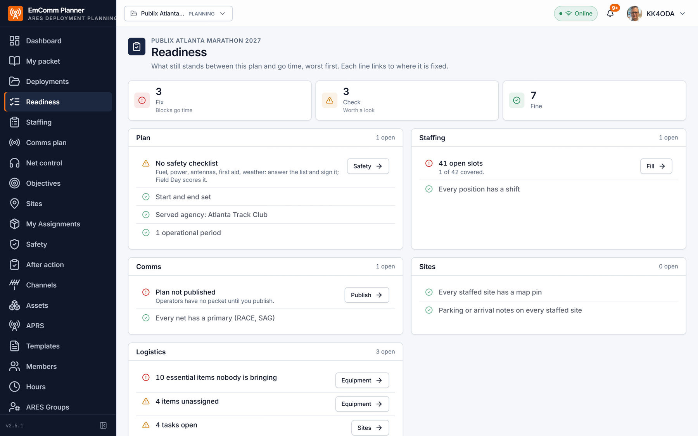

*Readiness for the marathon before staffing: open slots, an unpublished plan, essentials nobody brings, and the safety checklist not yet started. Green lines are what is already right.*

- **Fix** lines block go time: open slots, a plan that has not been published, a site without a pin.
- **Check** lines are worth a look: unassigned items, open tasks, a missing safety checklist.
- Every count updates live, so this is also the page to show the served agency when they ask how staffing is going.

## Step 10. Publish the plan

Publishing is what turns the plan into packets. The first publication sends every assigned operator their packet; later publications compare each packet with the last version and notify only the operators whose packet changed, with the changes listed in the message and a banner on their packet.

**Do this**

1. On **Staffing** or **Comms plan**, click **Publish plan**.
2. Read the list of changed positions. Add a **note to operators** if there is something everyone should know (weather, a closed ramp).
3. Tick **Notify everyone assigned** only for whole-event notes; otherwise leave it off so unaffected operators are not woken.
4. Click **Publish**.

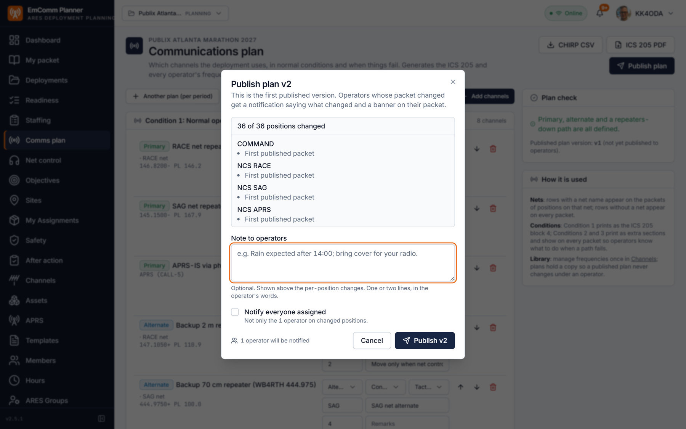

*Publish plan: the first version lists every position; later versions list only what changed since the last one.*

### The operator's packet

The packet is one page per assignment with everything needed to show up and get on the air: tactical call, report time, the primary frequency, the site with its map and notes, the full frequency list by condition, what to bring and who to report to. It works offline once opened.

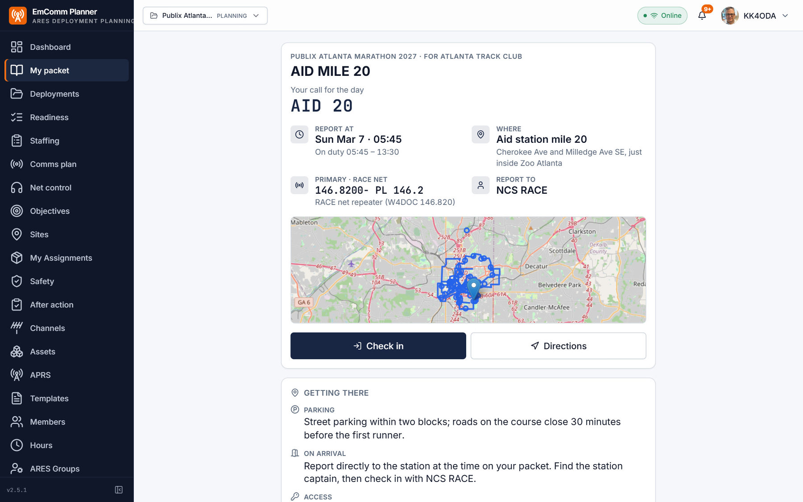

*My packet for AID MILE 20: the call for the day, report time, site, primary channel and net control, the course map, and Check in.*

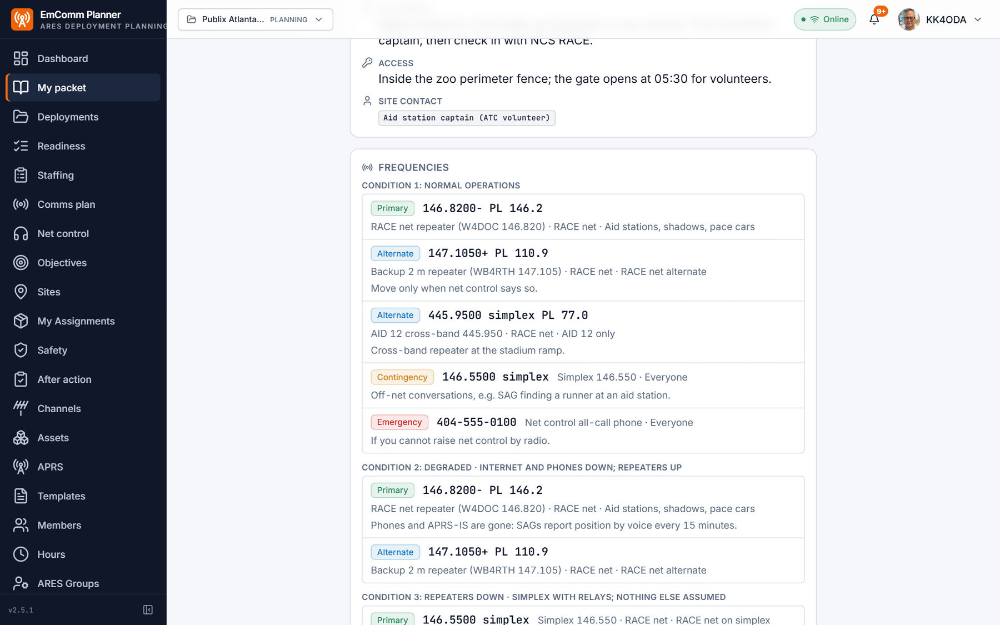

*Further down the packet: parking, arrival and access notes from the site, the frequency plan by condition, and the briefing notes from the position.*

> **Why it matters.** In 2026 the brief went out three times to everyone, each edition amending the last, with "we apologize for any changes". Publishing per position means an operator whose packet did not change never hears about the change at all.

## Step 11. Race day

### Safety checklist

Start the standard checklist under **Safety**, adjust the lines to this event (the generator lines become N/A, the trip-hazard and weather lines matter), answer every line on the morning and sign. Signing locks the record and clears the Readiness warning.

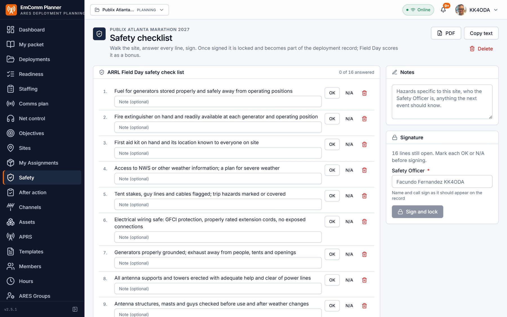

*The safety checklist: OK or N/A per line, notes, and the Safety Officer's signature. It also exports as PDF for the served agency.*

### The Operations board

Operators tap **Check in**, **On position** and **Check out** on their packets, over the air through APRS if the group runs a Graywolf station, or the desk records it for them. **Operations** is the event-day board for whoever runs the desk: every live shift worst first, the running log, and ICS 204, 205A and 214 exported from the same data.

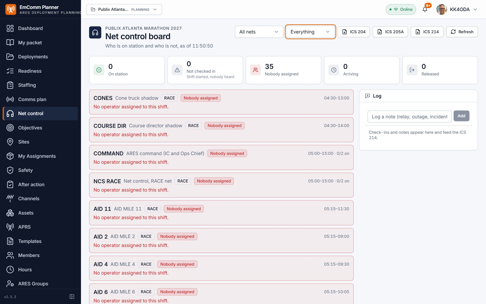

*The Operations board with the window set to Everything: one line per shift, worst first. On race day the lines turn green as operators check in and go on position; the log on the right feeds the ICS 214.*

- The time window at the top defaults to Now ±6 h so the desk sees what is live; set it to Everything while planning.
- Filter by net so the SAG desk sees vehicles only.
- Coverage checks operators log from their packets appear on the Sites map, building the group's real coverage record for next year.

## Step 12. After the event

Hours are recorded from check-in to check-out without anyone being asked. **After action** collects a two-minute form from every operator and assembles the record: participation, no-shows, incidents, coverage, every response. Turn the findings into lessons; open lessons follow the deployment when you duplicate it next year and appear on the positions they concern.

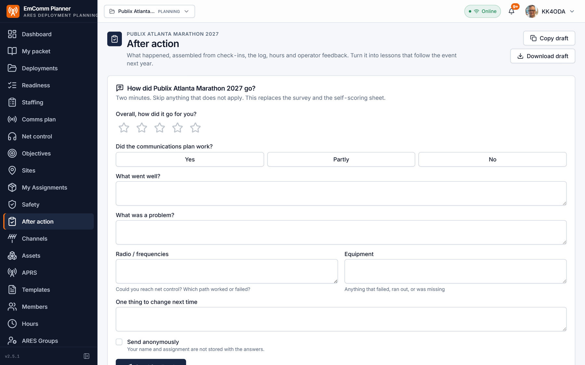

*After action: the operator form. Planners see the assembled record above it with Copy draft and Download draft for the written AAR.*

### Next year

- On **Deployments**, use **Duplicate** on this event: positions, shifts, comms plan, map layers and open lessons come along with every date shifted to the new start.
- Replace the course layer, adjust the aid stations the course change moved, and check Readiness. That is the twenty-minute version.
- The naming schemes you saved fill tactical calls and requirements as you type new positions.

### Where this scenario came from

Positions, report times, nets, frequencies, the stadium-ramp cross-band note, the SAG pickup vocabulary and the pace-car advice are from the DeKalb ARES material for the 2026 marathon: the shared assignments and frequencies sheet, the ARES map, the HRO handbook and the SAG net tactics notes. Volunteer names and phone numbers were left out; the all-call number is a placeholder. The 2027 course is new, so treat the aid station list as an example to adjust, not a plan to run.
