# Running Winter Field Day

*A step-by-step walk through EmComm Planner for a field exercise: stations instead of aid stations, operating periods, objectives, battery power and a safety checklist.*

> Scenario: Saturday 30 and Sunday 31 January 2027. DeKalb ARES operates WD5EMA, class 2O (two transmitters, outdoor), from the Stone Mountain Park campground. Operating period 1600 UTC Saturday to 2159 UTC Sunday: 11:00 Saturday to 16:59 Sunday local. A backup site at the DeKalb Fire HQ and EOC lot stands by for weather.
> Audience: the station captain or club planner. Operators read Steps 6 and 9.
> Time: about an hour. The exercise profile adds objectives and per-period shifts to what a public-service event uses.

Written for EmComm Planner 2.5.4. Live guide: https://emcommplanner.org/guide

## What you will build

Winter Field Day is not position-shaped like a marathon: the unit is a station, the schedule is a set of operating periods, and the point is a list of objectives everyone can see and sign up for. EmComm Planner models that with the same tools: positions become stations, shifts become operating slots, and the Objectives page carries the scoring list. This tutorial builds the whole weekend, from setup crew to log submission.

| Item | In this scenario |
| --- | --- |
| Event | Winter Field Day 2027, Saturday 30 to Sunday 31 January |
| Entry | WD5EMA, class 2O, section GA (two transmitters, outdoor) |
| Site | Stone Mountain Park campground, group site; backup at DeKalb Fire HQ and EOC parking lot |
| Stations | HF station (two operators per slot), VHF/UHF station, digital position (VarAC, JS8Call), Winlink gateway |
| Support | Station captain and logging, safety officer, setup crew of four, teardown crew of four, two rovers |
| Periods | Setup 08:00 to 11:00; Saturday operating 11:00 to 19:00; overnight to 07:00; Sunday operating and teardown to 19:00 |
| Objectives | Twelve, from the DeKalb ARES objectives document: primary, secondary and tertiary, 60 points in total |
| Power | 100 percent battery and solar; no grid power on the site by design |

### Before you start

- You are signed in with the **Planner** or **Admin** role.
- Have the current Winter Field Day rules open: the operational period and the objectives change every year, and the tutorial dates are for 2027.
- Decide the class and the club call before you start; they go in the tasking reference and on every packet.

> **Tip.** If you completed the marathon tutorial, the channel library already has the W4DOC repeater and the 146.550 simplex channel. Libraries belong to the group, not to one deployment.

## Step 1. Create the deployment

Pick the **Field Day / Winter Field Day** kind. It records hours under training and unlocks nothing exotic; the difference from a public-service event is in how you use periods and objectives.

**Do this**

1. Open **Deployments** and click **New deployment**.
2. Fill in the form from the table. Start is the beginning of setup, end is the end of teardown, not the contest period.
3. Under **Served agency and authorization**, put the club as the agency and the rules and entry class in the tasking reference.
4. Create it and pick it in the deployment switcher at the top.

**Enter this**

| Field | Value |
| --- | --- |
| Deployment name | Winter Field Day 2027 |
| Kind | Field Day / Winter Field Day |
| Starts / Ends | 01/30/2027 08:00 AM to 01/31/2027 07:00 PM |
| Region / area | Stone Mountain Park, GA |
| Description | Annual cold-weather field exercise. WD5EMA class 2O from the Stone Mountain Park campground: HF, VHF/UHF, digital and a Winlink gateway, all on battery and solar. 1600 UTC Saturday to 2159 UTC Sunday. |
| Served agency | DeKalb ARES (exercise) |
| Requesting official | DeKalb ARES Emergency Coordinator |
| Tasking reference | Winter Field Day 2027 rules; club call WD5EMA, class 2O, section GA |

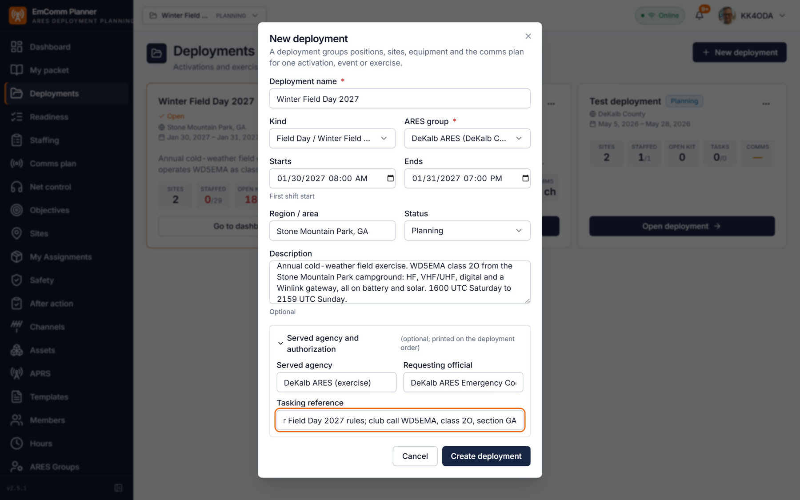

*New deployment for Winter Field Day. The kind drives the hours category; everything else is the same form.*

## Step 2. Define the operating periods

Operational periods give the weekend its shape. Shifts and the communications plan are scoped to them, and the ICS forms print per period. Four periods cover setup, Saturday, the overnight and Sunday with teardown.

**Do this**

1. Open **Staffing** and click **Periods**.
2. Click **Add period** for each row in the table.

**Enter this**

| Label | From | To |
| --- | --- | --- |
| Setup | Sat 30 Jan 08:00 | Sat 30 Jan 11:00 |
| Saturday operating | Sat 30 Jan 11:00 | Sat 30 Jan 19:00 |
| Overnight | Sat 30 Jan 19:00 | Sun 31 Jan 07:00 |
| Sunday operating and teardown | Sun 31 Jan 07:00 | Sun 31 Jan 19:00 |

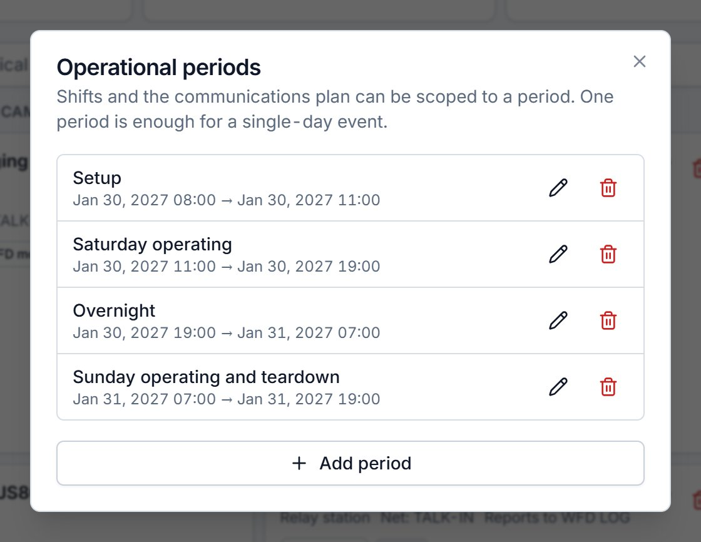

*Operational periods for the weekend. Each shift you create next is attached to one of them.*

> **Why it matters.** The 2026 rules run the contest 1600 UTC Saturday to 2159 UTC Sunday, which is 11:00 to 16:59 local. Setup may start the Friday but cumulative setup time is capped; putting setup in its own period keeps the record honest.

## Step 3. Add the site and the backup

One operating site plus the backup that a weather call might send everyone to. In 2026 the site changed 48 hours out; with both sites in the plan the move is one edit and one publication rather than a night-before video call.

**Do this**

1. Open **Sites**, click **Add site**, and enter the campground from the table. Click the map on the group site to place the pin.
2. Add the backup site the same way, with a note explaining when it is used.

**Enter this**

| Field | Stone Mountain Park campground, group site |
| --- | --- |
| Type | Staging / muster point |
| Location | 4003 Stonewall Jackson Dr, Stone Mountain, GA 30083 (pin on the group site) |
| Site contact | Station captain (WFD LOG) |
| Parking | Park entry fee or annual pass at the gate. Park on the gravel pad next to the group site; keep the loop road clear for the campground host. |
| Arrival | Enter by the East Gate off US-78 (exit 8), follow the campground signs, then the loop to the group site. Setup starts 08:00 Saturday; operating starts 11:00 sharp. |
| Access | Campground gate closes at 22:00; get the code from the station captain if you arrive later. Cell coverage is one to two bars; the site has no grid power by design. |

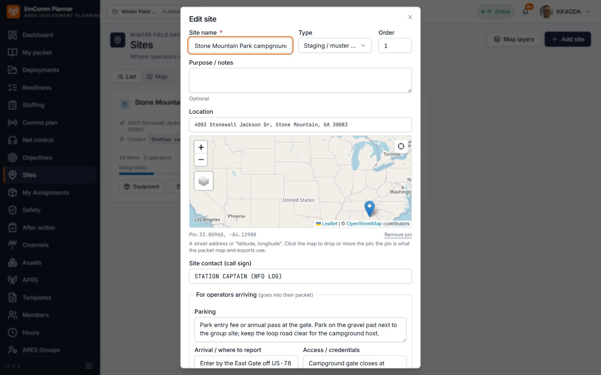

*Edit site for the campground. The arrival and access notes are exactly what a first-time operator asks about.*

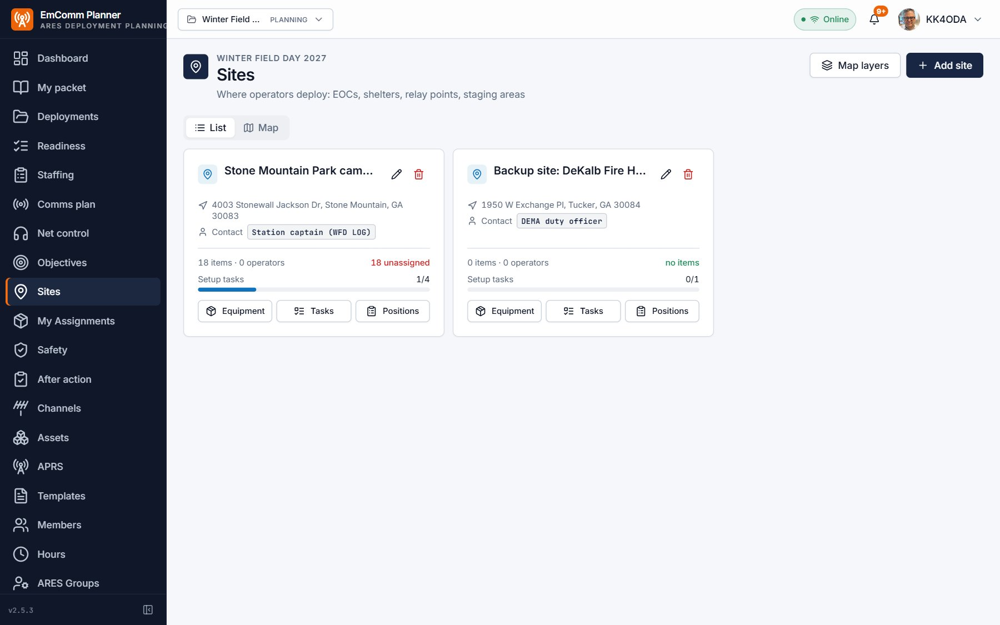

*Sites: the campground and the backup lot. The backup note records that simplex from the lot to the mountain failed at 50 W in the 2026 drill.*

## Step 4. Create the stations and crews

Each station is a position of type **Field station** with a tactical call, a headcount per slot and one shift per operating slot. The captain, the safety officer, the crews and the rovers are positions too, so they show on the board and count hours.

**Do this**

1. On **Staffing**, click **Position** and create **HF station** from the table: type Field station, tactical call WFD HF, headcount 2, net TALK-IN, reports to the station captain.
2. Add one shift per operating slot: Sat 11:00-15:00, 15:00-19:00, 19:00-23:00; Sun 07:00-11:00, 11:00-17:00. Attach each shift to its period; set muster 15 minutes before the slot.
3. Repeat for the other rows. Rovers have no site; leave **Site** empty for mobile positions.

**Enter this**

| Position | Tactical | Type | Seats | Shifts | Requirements |
| --- | --- | --- | --- | --- | --- |
| Station captain and logging (N1MM) | WFD LOG | Command post | 1 | Whole event | HF voice; N1MM WFD module |
| HF station | WFD HF | Field station | 2 | Five 4 h slots (six on Sunday) | HF voice; Technician or higher |
| VHF/UHF station | WFD VHF | Field station | 1 | Four slots | VHF voice |
| Digital position (VarAC, JS8Call) | WFD DIGI | Field station | 1 | Sat 11-19, Sun 07-17 | HF voice; VarAC or JS8Call experience |
| Winlink gateway | WFD GATEWAY | Relay station | 1 | Sat 09:00 to Sun 17:00 | Winlink over VARA FM; Starlink or hotspot |
| Safety officer | WFD SAFETY | Other | 1 | Whole event | Prior safety officer role (nice to have) |
| Setup crew / Teardown crew | SETUP / TEARDOWN | Other | 4 | Sat 08-11 / Sun 17-19 | none |
| Rover 1, Rover 2 | ROVER 1, ROVER 2 | Other, mobile | 1 | Sat 12-16 / Sun 09-13 | VHF voice, APRS, mobile station |

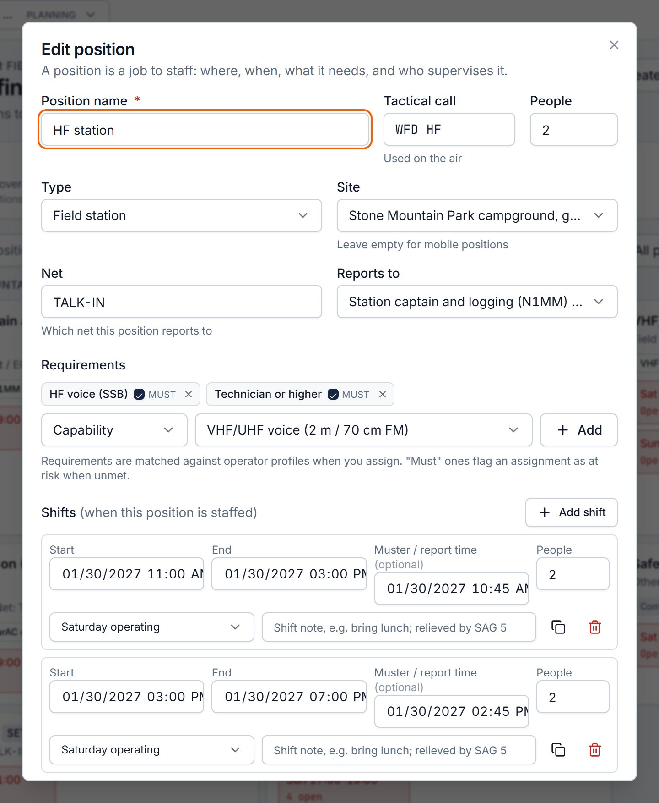

*Edit position for the HF station: two seats per slot, the Technician-or-higher requirement (Technicians operate HF under the control operator), and the slots attached to their periods.*

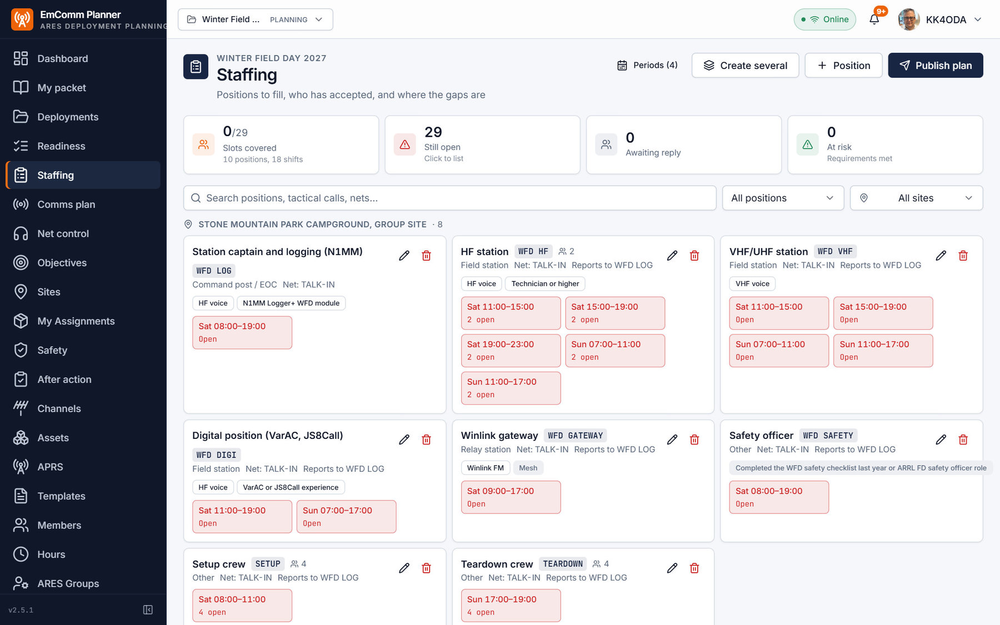

*Staffing with every station and crew: 10 positions, 18 shifts, 29 seats. The captain and the safety officer span the whole weekend.*

> **Tip.** Write the exchange into the briefing notes of every station: WD5EMA 2O GA. Whoever sits down at 03:00 reads it off the packet instead of asking.

## Step 5. Talk-in and the rover paths

A field exercise still needs a communications plan: how people find the site on the way in, how rovers reach it, and what happens when the repeater is down. Add the WFD-specific channels to the library, then the plan.

**Do this**

1. On **Channels**, add the rows from the table (the repeater and 146.550 already exist if you did the marathon tutorial).
2. On **Comms plan**, choose the **Saturday operating** period, add the channels, and assign the talk-in rows to the net **TALK-IN** so they print on every packet.
3. Add a Condition 3 row: simplex with a relay through Rover 1 from the mountain road.

**Enter this**

| Channel | Kind | Details | Role in the plan |
| --- | --- | --- | --- |
| Simplex 146.550 | Simplex | 146.550 | Primary, talk-in and rovers |
| W4DOC 146.820 repeater | Repeater | 146.820- PL 146.2 | Alternate, also the backup-site link |
| APRS 144.390 (RF) | Digital / APRS | Message to WD5EMA | Alternate for rovers |
| 40 m VarAC 7.105 USB | Digital / VARA HF | 7.105 USB | Contingency, rovers with HF |
| WD5EMA Winlink gateway | Digital / VARA FM | 145.070 to WD5EMA-10 | Contingency, Winlink traffic |
| Station captain mobile phone | Phone number | your number | Emergency; weak signal, text first |

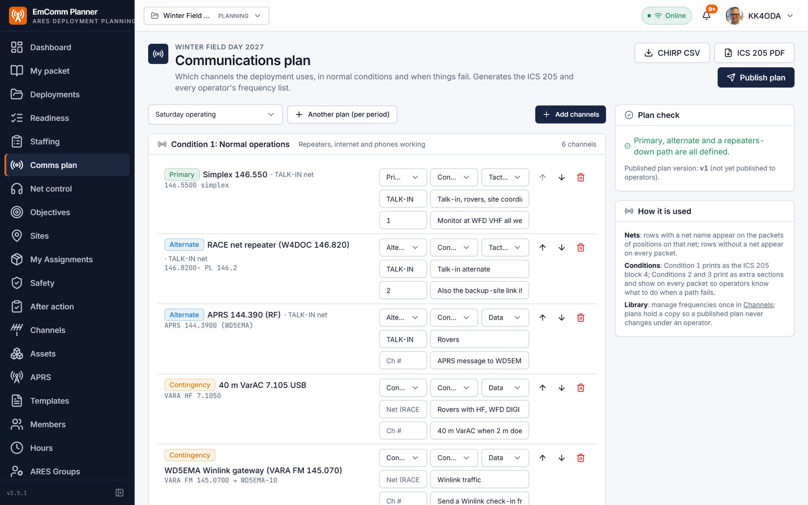

*The WFD plan scoped to the Saturday operating period. Rows on the TALK-IN net appear on every station's packet.*

## Step 6. Post the objectives

Objectives are the point of the weekend. Post them where everyone sees them, with points that mirror the rules' objective multipliers, and let people take them. Completion feeds the after-action record and the log submission.

**Do this**

1. Open **Objectives** and click **Add objectives**.
2. Enter each objective with a category (primary, secondary, tertiary), a one-line description and points.
3. On the day, operators click **I will take this**, then **Done**; the captain can mark done or drop from the same list.

**Enter this**

| Objective | Category | Points |
| --- | --- | --- |
| Field station on the air for 6 continuous hours | primary | 10 |
| Shelters up for comfortable operating | primary | 5 |
| Three QSOs on each of six bands (80, 40, 20, 15, 10, 2 m) | primary | 10 |
| Every QSO logged in N1MM and exported as ADIF | primary | 5 |
| Three modes worked: SSB, FM and digital (JS8Call or VarAC; WSJT modes do not count) | primary | 5 |
| 100 percent battery and solar, no grid power | secondary | 5 |
| QSOs from more than one HF antenna and one VHF/UHF antenna | secondary | 3 |
| Winlink gateway with CMS access over Starlink | secondary | 5 |
| Copy the WFD special bulletin | tertiary | 3 |
| Satellite QSO | tertiary | 3 |
| Local Winlink post office linked to the gateway | tertiary | 3 |
| Rover check-ins from three locations by APRS, then simplex or VarAC | tertiary | 3 |

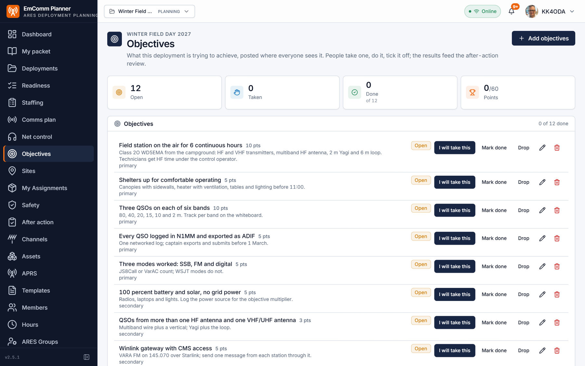

*Objectives: open, taken, done and points at the top; every objective with its actions below. This is the list from the DeKalb ARES objectives document.*

> **Why it matters.** The 2026 drill debrief said it plainly: having specified objectives helped, and people should sign up for them. This page is that sign-up sheet.

## Step 7. Equipment, power and assets

Two lists do different jobs. The **Dashboard** carries the per-site equipment list for this event (what must be on the site, who brings it). **Assets** is the group's inventory with custody (who has the club rig right now). Field Day is where both earn their keep.

**Do this**

1. On **Dashboard**, create the categories Stations, Power, Shelter and comfort, Safety, and add the items. Mark radios, antennas, batteries, the canopy, the heater and the first aid kit **essential**.
2. **Assign** each item to the member who brings it; Readiness warns about essentials nobody is bringing.
3. On **Assets**, add the club gear once: the IC-7300, the two 100 Ah LiFePO4 batteries, the push-up mast, the 2 m Yagi. Before the event the person who collects them clicks **I have it**; on site, **On site at**; afterwards **Returned**.

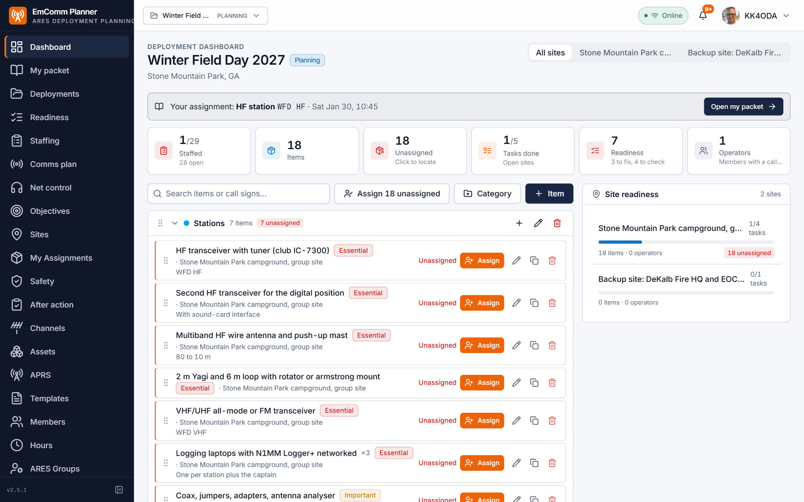

*Dashboard for WFD: the Stations category with the club IC-7300, second HF rig, antennas and logging laptops, all still unassigned.*

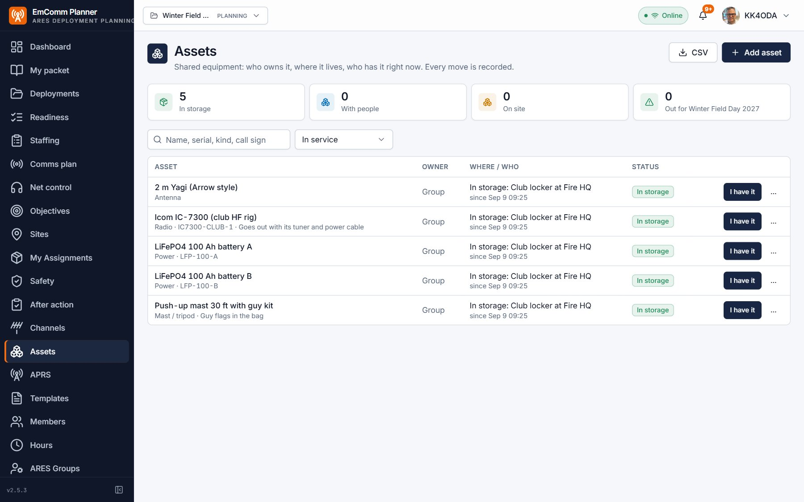

*Assets: the group inventory with custody state. Mark all returned closes the weekend.*

> **Tip.** "Does anyone know where that cord is?" is the question the asset list answers. Custody changes are one tap and are visible to everyone in the group.

## Step 8. Sign people up

With four operating slots on two stations plus crews, the schedule is the old spreadsheet grid. Here every slot is a shift chip: click it to offer or assign, or let members take open slots themselves from **My Assignments**.

**Do this**

1. On **Staffing**, click a slot under **HF station**. The dialog lists who could take it, ranked by profile match.
2. **Offer** it or **Assign as confirmed**. Two seats per slot means two people can hold it.
3. For empty slots the day before, click **Notify N qualified**.

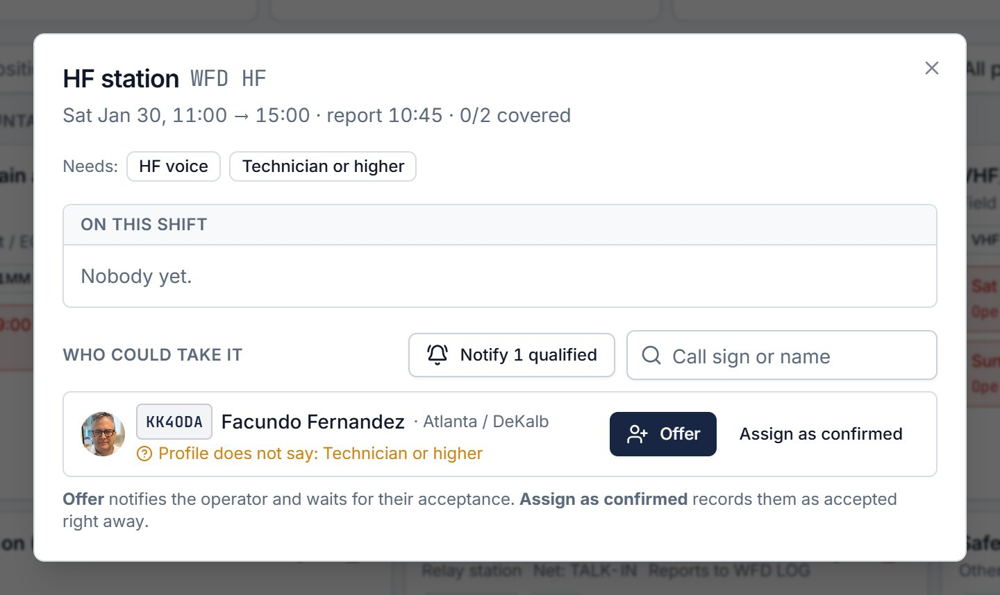

*Assign dialog for the first HF slot: two seats, HF voice and licence requirements, and the candidates with their match.*

### Publish

Publish the plan once the slots and the site are settled. Everyone assigned gets a packet with the campground notes, the talk-in frequency and their slot. A weather move to the backup site is a site change and a new publication; only the operators whose packet changed are notified.

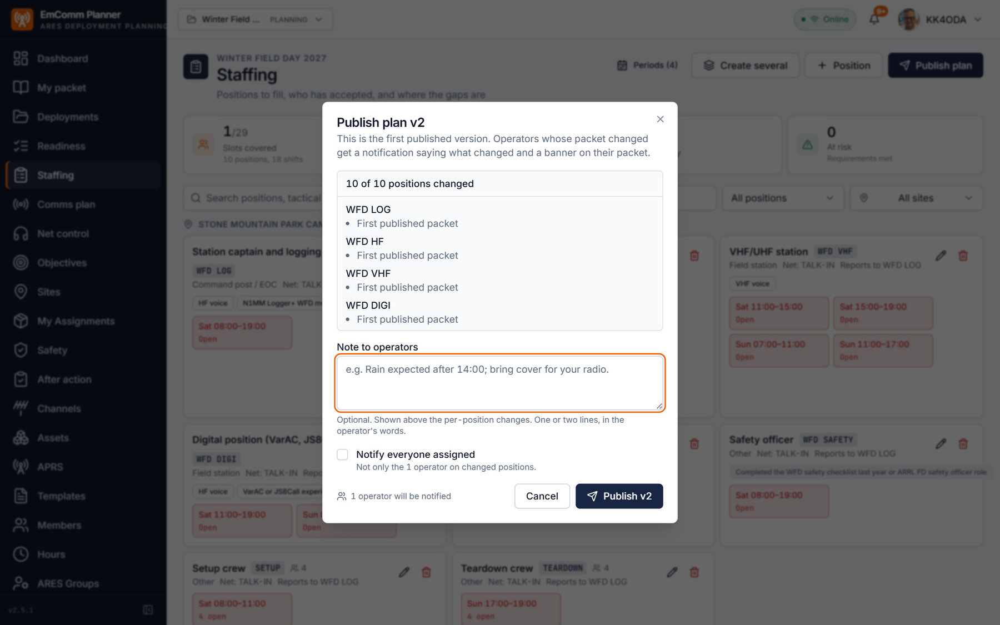

*Publish plan for WFD. The note to operators is the place for "Bring sleeping bags rated for 20 F".*

## Step 9. On the weekend

### Safety officer first

Under **Safety**, start the standard checklist Saturday morning, walk the site, answer each line and sign. It is the ARRL Field Day safety list; fuel, generator and antenna lines all apply here. The signed checklist is part of the record and clears the Readiness warning.

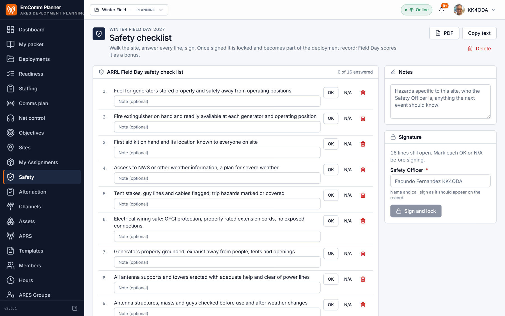

*The safety checklist before the walk-around. Sign and lock when every line is OK or N/A.*

### The operator's packet

Each operator opens **My packet** on the way out: report time, the station and its tactical call, the talk-in frequency, the campground map and the gate notes. Check in on arrival, On position when the radio is on the air, Check out at the end of the slot. It works with one bar of signal or none.

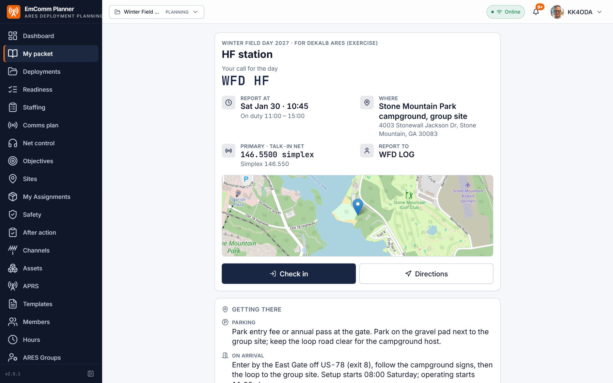

*My packet for the first HF slot: WFD HF, report 10:45 for an 11:00 start, talk-in on 146.550, the campground pin, and Check in.*

### Net control board and readiness

The captain keeps **Net control** open with the window set to Everything: who is on station at each position and who has not arrived, plus ICS 214 for the log. **Readiness** shows what is still open before the contest clock starts.

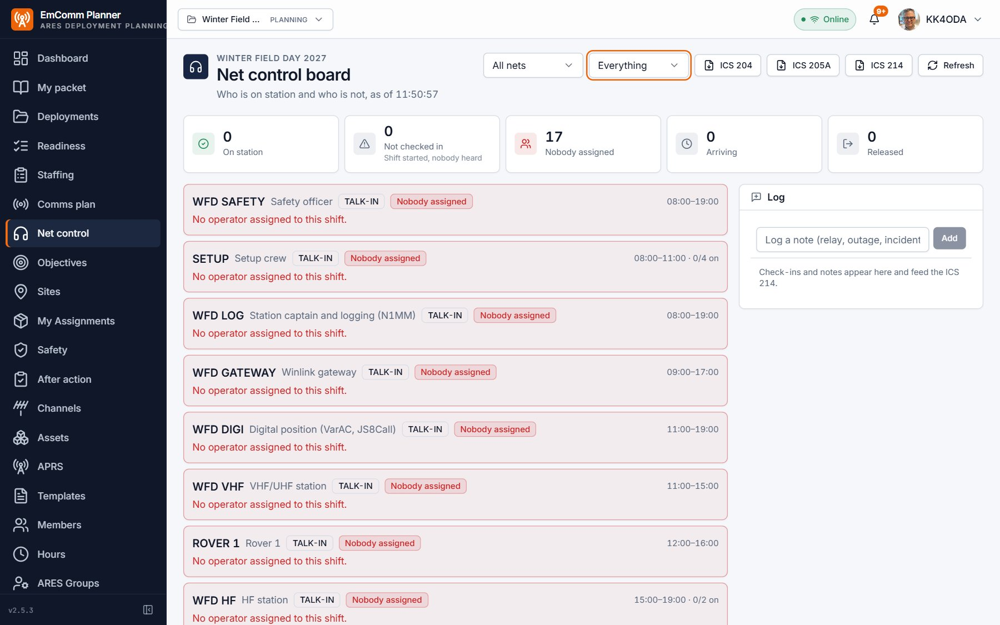

*Net control for the weekend, one line per position, worst first.*

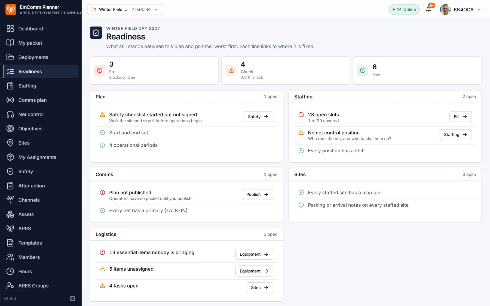

*Readiness before the weekend: open seats, the unpublished plan and the unsigned checklist are the three lines to clear.*

## Step 10. After the weekend

The log goes to Winter Field Day by 1 March with the objectives ticked and the bulletin text pasted in; the task list carries that date. In EmComm Planner, **After action** collects each operator's two-minute form, assembles participation, hours and objectives, and turns findings into lessons. Publish the score back to the group from the same page: "were they ever turned in?" should never be asked again.

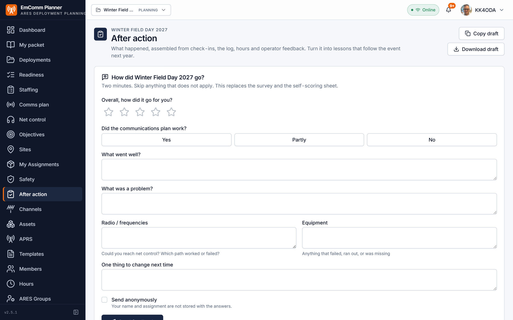

*After action for WFD: the operator form and, for planners, the assembled record with Copy draft and Download draft.*

### Next year

- **Duplicate** the deployment: stations, slots, periods, objectives and open lessons come along with the dates shifted.
- Update the objectives to the new rules and the dates to the new last full weekend of January.
- Check the campground reservation task and the weather-call task; both carry over with new due dates.

### Where this scenario came from

The objectives are the DeKalb ARES Winter Field Day objectives document. The entry class, club call and section are from the group's 2026 log. The operating period, bulletin schedule and the WSJT exclusion are from the 2026 Winter Field Day rules; check the current year's rules before you plan. The campground address and the backup-site simplex note are from the 2026 drill material.
